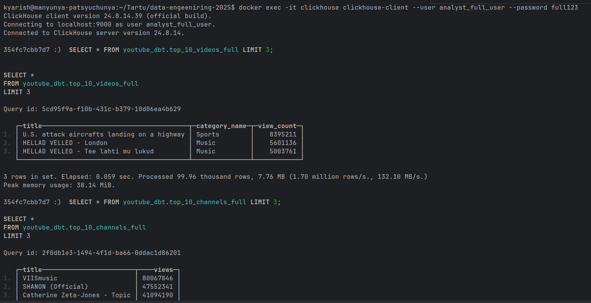
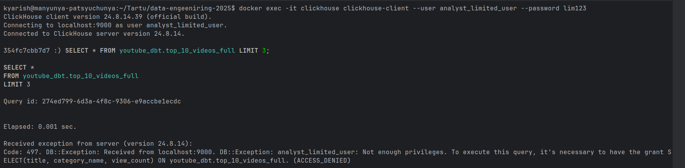

# YouTube Analytics Data Platform

This project delivers a modular, end‑to‑end analytics platform built on a modern data engineering stack. The architecture is composed of several coordinated services: Airflow orchestrates ELT workflows, ClickHouse serves as the high‑performance analytical database, dbt manages SQL transformations and enforces data quality, Iceberg (optional) provides table‑format capabilities, Superset exposes BI dashboards, and OpenMetadata ensures lineage, documentation, and governance. Together, these components form a production‑ready pipeline that ingests raw YouTube data, transforms it into dimensional models, applies secure role‑based access control with masking, and enables interactive analytics.

Full ELT Pipeline • ClickHouse • Airflow • dbt • Iceberg • Superset • OpenMetadata

---

# 1. How to Run the Project

## 1. Clone the repository

```bash
git clone <your-repo-url>
cd project3
```

## 2. Start all services

```bash
docker compose up -d --build
```

## 3. Check system health

```bash
docker compose logs -f
```
---

### 4. Fixing Airflow File Permission Errors

If Airflow fails to start with logs like:

```
PermissionError: [Errno 13] Permission denied: './airflow/logs'
```

Run:

```bash
sudo chown -R $USER:$USER ./airflow/logs
sudo chmod -R 777 ./airflow/logs
```

This ensures Airflow can write logs inside the mounted volume.

---
# 2. Setup Database

## Access Airflow

To open the Airflow UI, go to:

```
http://localhost:8083
```

Login credentials:

```
username: admin
password: admin
```

---

## Populate ClickHouse with Initial CSV Data

To load raw CSV files into ClickHouse, trigger the Airflow DAG:

* `load_initial_csv`

This DAG inserts the raw YouTube CSV data into the `raw_youtube` schema.

---
## Load Initial csv youtube_channels as iceberg table

To load youtube channels into clickhouse as iceberg table, trigger the Airflow DAG:

* `iceberg_bronze_layer `

This DAG inserts the raw youtube_channels CSV data into the `bronze` database.
NOTE: this is a standalone table. Downstream processes do not rely on it.

---

## DBT Part

### Running dbt from the terminal

Enter the dbt environment inside the Airflow worker:

```bash
docker exec -it dbt bash
```

Then run the full dbt pipeline:

```bash
dbt snapshot
dbt run
dbt test
```

---

### Running dbt using Airflow

You can also run the dbt transformations through Airflow by triggering these DAGs:
* `dbt_silver_layer` — builds the Silver layer models
* run in dbt dt shell dbt snapshot
* `dbt_gold_layer` — builds the Gold layer models

This way, your entire ELT process is orchestrated inside Airflow.

# 3. ClickHouse Roles, Users, Permissions & Masking

The project implements secure data access using ClickHouse roles and masked views for sensitive data fields.

## Roles Created

| Role                | Permissions                                  | Purpose                              |
| ------------------- | -------------------------------------------- | ------------------------------------ |
| **analyst_full**    | Full SELECT on all gold and analytics models | Internal analysts / engineers        |
| **analyst_limited** | SELECT only on masked, privacy-safe views    | External analysts / restricted users |

## Users Created

| User                   | Role            | Password     |
| ---------------------- | --------------- | ------------ |
| `analyst_full_user`    | analyst_full    | `full123`    |
| `analyst_limited_user` | analyst_limited | `lim123` |

---
## Masking Logic (What is masked, how it is masked, and why)

### Columns Selected for Masking

| Analytical View           | Column Masked | Masking Function                      | Reason (Demo)                                            |
| ------------------------- | ------------- | ------------------------------------- | -------------------------------------------------------- |
| `top_10_channels_limited` | channel_title | `toString(cityHash64(channel_title))` | Represents identity of the channel — demo-sensitive data |
| `top_10_videos_limited`   | video_title   | `toString(cityHash64(video_title))`   | Represents title of the video — demo-sensitive data      |
| `top_10_videos_limited`   | category_name | `toString(cityHash64(category_name))` | Added as third required masked column (dummy sensitive)  |

> Note: The dataset does **not** contain real PII or confidential fields. These columns were masked **only to satisfy project requirements** that at least three fields must be pseudonymized.

## How to set roles and how to use

### 1. Creating Roles and Users

```
docker exec -i clickhouse clickhouse-client --user default --password password  < clickhouse/setup_access.sql
```
### 2. Logging into ClickHouse With Each Role


#### Full-access user

```bash
docker exec -it clickhouse clickhouse-client --user analyst_full_user --password full123
```

#### Limited-access user

```bash
docker exec -it clickhouse clickhouse-client --user analyst_limited_user --password lim123
```
---

### 3. Query example

```sql
SELECT * FROM youtube_dbt.top_10_channels_full LIMIT 5;
```

# 4. OpenMetadata

URL:
[http://localhost:8585](http://localhost:8585)

Login:

```
admin / admin
```

Screenshot placeholder:

```

```

---

# 5. Superset Dashboard

Make sure dbt snapshot is done and after the snapshot rerun golden layer dag.

URL:
[http://localhost:8088](http://localhost:8088)

Login:

```
admin / admin
```

Steps:

1. Connect to ClickHouse
Add New Database
Choose Clickhouse Connect
Host is clickhouse, port is 8123
database name is youtube_dbt
username and password are “default”

2. Create datasets from youtube_dbt.

   *`07_top_cat_by_view`
   *`02_top_10_videos_by_topic_category`
   *`01_top_10_channels`

3. Build dashboard with:

   * at least **2 charts**
   * at least **1 filter**

The YouTube Analytics dashboard displays key metrics derived from the youtube_dbt ClickHouse database.

Screenshot:


---







```docker exec -i clickhouse clickhouse-client \
  --user default --password password \
  < clickhouse/setup_access.sql```
